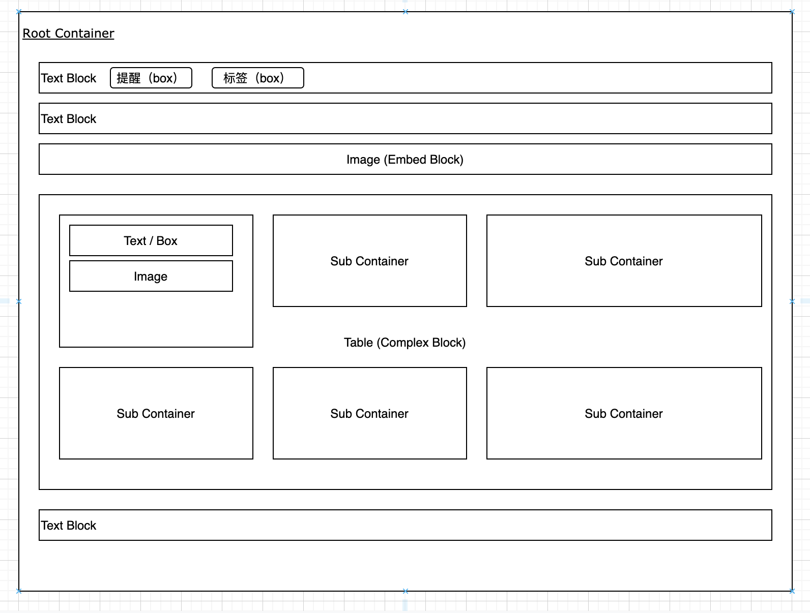

# wiz-editor 编辑器结构



## 基本概念

编辑器包含一下三种结构：

1. Container
2. Block
3. Box

### Block

Block是编辑器里面的一个基础组件，相当于文章里面的一个段落（或者一个图片，一个视频等等）。block有三种类型：

1. Text Block
2. Embed Block
3. Complex Block

#### Text Block

可以在block里面输入文字，插入提醒等。这种block类似于一个contentEditable的div。用来支持用户输入文字。

#### Embed Block

这种block，通常用来展示内容，而不是接受用户输入。例如显示一个图片，视频，或者插入一个Office文件（可以直接预览）。
光标可以定位在这种block前后（可以通过delete/backspace删除整个block），但是不能将光标定位在block里面。

#### Complex Block

这种block里面会包含其他的block，例如表格，每一个单元格，都可以独立输入文字，插入图片等内容。

### Container

container，里面包含了一组block。例如编辑器有一个默认的rootContainer，里面包含了所有的block。

complex block里面，至少应该包含一个子container。例如表格，里面每一个单元格，都是一个独立的container。
用户可以在这些container里面进行输入。

### Box

Box不是一个block，而是一个更小的组件。Box可以插入到Text Block里面，并作为一个整体进行编辑。例如用户可以插入一个box，然后删除这个box。

box内部是不允许编辑的。例如用户插入了一个提醒，这个提醒包含了用户头像以及昵称。用户可以将这个提醒直接删除，但是不能更换头像或者修改里面的昵称。

如果要修改，需要删除这个提醒重新插入新的提醒。

编辑器内置了提醒，标签等box。

每一个box，都是由一个span作为容器，里面可以包含若干文字/图片的dom组件。

用户可以通过快捷键输入box，也可以通过下拉框选择输入box。

## 扩展编辑器

### 扩展Block/Box。

可以扩展一个基本的block（必须是text/complex/embed三种之一）。

block的定义如下：

```ts
export interface BlockOptions {
    textBlock?: boolean; // 是否是文字类型的block
    complexBlock?: boolean; // 是否是complex block
}
export interface Block {
    // 获取block类型
    getBlockOptions?: () => BlockOptions;
    // 如果是文字类型的block，需要实现这个方法。返回一个HTMLElement。这个HTMLElement将会作为编辑区域
    getTextElement?: (block: BlockElement) => RichTextElement;
    // 创建一个block data数据。所有类型的block都需要实现
    createBlockTemplateData: (editor: Editor, options: any) => BlockTemplateData;
    // 创建block content 元素。其中text block，需要返回一个可编辑的HTMLElement作为文字容器（例如div，li， heading）。对于complex block，可以返回任意HTMLElement（例如table等）
    createBlockContent: (editor: Editor, id: string, data: BlockData) => BlockContentElement;
    // 通过数据更新block，通常在远程其他用户修改了block之后，会调用这个方法更新本地ui。例如image，远程用户修改了大小，或者src，就会调用这个方法更新图片
    updateBlockData: (block: BlockElement, data: BlockData) => void;
    // 更新block text。例如远程用户修改了block的文字。 （text类型的block需要实现）
    updateBlockText?: (block: BlockElement, data: RichTextOperations) => void;
    // 执行文字命令。例如粗体，斜体等。text类型block需要实现
    executeTextCommand?: (block: BlockElement, command: TextCommand, start: number, end: number, params?: CommandParams) => any;
    // 执行block命令，例如转换为heading，list等
    executeBlockCommand?: (block: BlockElement, command: BlockCommand, params?: CommandParams) => any;
    // 获取文字状态，例如返回当前文字的样式（粗体，斜体等）
    getTextCommandStatus?: (block: BlockElement, offset: number) => TextAttributes;
    // 保存数据，例如保存文字等
    saveData: (block: BlockElement) => BlockData;
    // 响应键盘事件
    handleKeydownEvent?: (block: BlockElement, detail: SelectionDetail, event: KeyboardEvent) => boolean;
    // 响应文字修改事件（例如input事件）
    handleBlockTextChanged?: (block: BlockElement) => boolean;
    // 响应block被插入到编辑器的事件（block已经被插入）。编辑器初始化block的时候不会调用这个方法。
    handleBlockInserted?: (block: BlockElement, options: InsertBlockOptions) => void;
    // 响应block被加载到编辑器的事件，编辑器初始化的时候会调用
    handleBlockLoaded?: (block: BlockElement) => void;
    // 响应block被删除的事件
    handleBlockDeleted?: (container: ContainerElement, index: number, blockData: BlockData, options: DeleteBlockOptions) => void;
    // 响应粘贴事件
    handlePaste?: (block: BlockElement, data: ClipboardData, detail: SelectionDetail) => boolean;
    // 获取子container数据。complex 类型的block必须实现
    getChildContainersData?: (block: BlockElement) => ContainerData[];
    // 获取光标位置
    getCaretPos: (block: BlockElement, node: Node, nodeOffset: number) => number;
    // 根据pos创建range。对于complex block，必须将range设置到子container的block里面。（调用子block的createRange方法）
    createRange: (block: BlockElement, pos: number) => Range;
    // 响应选中状态改变
    handleSelectionChanged?: (block: BlockElement, detail: SelectionDetail, lastEvent: MouseEvent | KeyboardEvent | null, lastPosition: Position) => boolean;
    // 通过方向获取子container。例如表格里面，获取某一个子container
    getSubContainerInComplexBlock?: (block: BlockElement, element: HTMLElement, type: 'top' | 'right' | 'bottom' | 'left') => ContainerElement | null;
    // 获取工具栏选项
    getToolbarOptions?: (block: BlockElement, target: Element) => ToolbarOptions | null;
    // 获取右键菜单选项
    getContextMenuData?: (block: BlockElement, detail: SelectionDetail) => MenuData;
    // 通知事件。其中name为事件名称
    notify?: (block: BlockElement, name: string, data: any) => void;
    // 转换为text
    toText?: (block: BlockElement, startOffset?: number, endOffset?: number) => string;
    // 替换子container id。将文档里面的子container id替换为新的id。complex block必须实现
    replaceChildrenId?: (doc: EditorDoc, data: DocBlock) => void;
    // 当在一个text block里面回车的时候，返回新建的block的数据。
    createSplittedBlockData?: (block: BlockElement) => BlockTemplateData;
    // 是否可以插入新的block或者box。仅针对complex block生效。例如code里面不允许插入图片等。
    accept?: (type: BOX_TYPE | BLOCK_TYPE) => boolean;
}
```

要实现一个text / complex类型的block，需要实现上面的方法并进行注册。

而要实现一个embed类型的block，则简单的多，只需要实现下面的接口即可：

```ts
export interface EmbedData {
  [index: string]: any;
};

export interface Embed {
  // 返回一个EmbedElement（就是HTMLElement）
  createElement(editor: Editor, data: EmbedData): EmbedElement;
  // 保存数据： 从EmbedElement里面保存数据
  saveData(editor: Editor, embed: EmbedElement): EmbedData;
  // 更新数据（例如从服务器更新新的数据）到界面（dom）
  updateData(editor: Editor, embed: EmbedElement, data: EmbedData): void;
  // 获取工具栏按钮，可以不实现
  getToolbarOptions?: (block: BlockElement, target: Element) => ToolbarOptions | null;
};
```

#### 例子

1. [自定义complex block](./complex-block.md)
2. [自定义embed block](./embed-block.md)

### 扩展box

[如何自定义box](./box.md)
